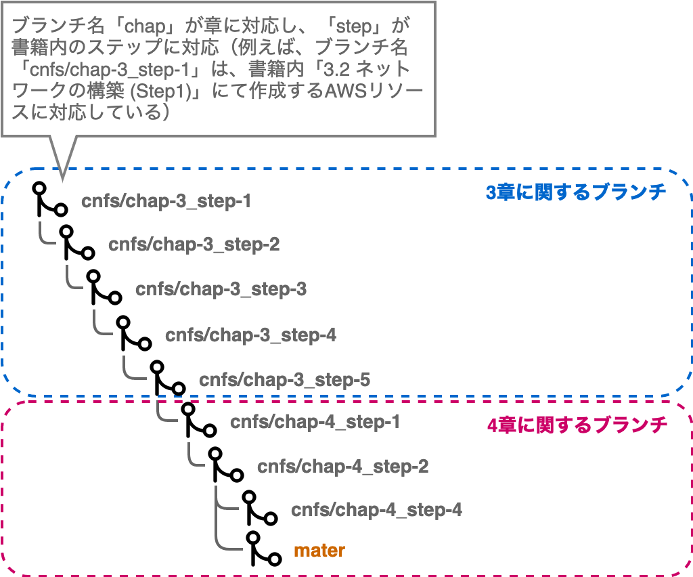

# Terraformを利用した書籍「AWSで学ぶクラウドネイティブ実践入門」のハンズオン実施

本リポジトリのTerraformソースコードは書籍「AWSで学ぶクラウドネイティブ実践入門」の内容と連動してAWSリソースを作成することができます。

具体的には、書籍内3章で作成するVPCやサブネットといったネットワークの設定、ECSなどのコンテナ定義といったリソースや4章で作成するCodeCommitやCodePipelineなどのリソースについて、各章内のStepと併せて作成することができます。

普段AWSマネジメントコンソールからの作業ではなく、IaCなどTerraformを利用している方はこちらのソースコードを利用したハンズオンとしてご活用ください。

## 利用に関する前提事項

本手順はREDOME.mdに記載の内容を基に作成しています。
事前にREDOME.mdを参照いただき、必要な環境をセットアップした上で実施してください。

## 注意事項

### Terraform対象外のAWSリソース

現時点においてTerraformでは、すべてのAWSリソースを作成できるわけでなく、Featureとして対応中の対象も含まれています。
また、Cloud9のように、一部のリソースに関してはTerraform内に完結して関連するAWSリソースを組み合わせることが難しいケースもあります。

そのため、**書籍内で扱うすべてのAWSリソースを本ソースコードから作成できるわけではありません**。
このようなAWSリソースについては、各Stepのリソース作成手順内にて適宜補足していきます。

### 一部Terraformリソースの引数について

Amazon AuroraやAmazon Systems Managerパラメーターストアなどで扱う認証情報等においては、Terraformソースコード上はダミー値として定義し、Terraformでの差分検知対象外としています(一般的にクレデンシャルとして扱われる情報はソースコード等のフラットに扱われるファイルに記述すべきではない、という思想です)。

以上の理由により、**認証情報はAWSリソース作成後に手動で変更する方針**としています。
こちらについても、適宜各Stepのリソース作成手順内にて触れていきます。

### 書籍ハンズオン内容との差分について

本Terraformから作成されるALBとAuroraについて、利用後の削除作業簡単にするため**削除保護を無効化**しています。
一方、書籍ハンズオンの手順ではこれらの削除保護を有効化しています。**本番環境での運用を考えると削除保護は有効化が望ましい**設定となります。
あくまで、Terraformリソース作成後の削除しやすさを考慮した設定となっているためご留意ください。

## 事前の設定事項

### ソースコードの取得

REDOME.mdで作成したCloud9上で必要なブランチを取得します。

	``` bash
	$ mkdir terraform; ls -l; cd terraform

	$ git clone https://github.com/iselegant/cntfdemo

	$ cd cntfdemo

	$ for remote in `git branch -r`; do git branch --track ${remote#origin/} $remote; done

	$ git branch
	cnfs/chap-3_step-1
	cnfs/chap-3_step-2
	cnfs/chap-3_step-3
	cnfs/chap-3_step-4
	cnfs/chap-3_step-5
	cnfs/chap-4_step-1
	cnfs/chap-4_step-2
	cnfs/chap-4_step-4
	* master

	$ git pull --all
	Already up-to-date.

	$ git checkout cnfs/chap-3_step-1
	Switched to branch 'cnfs/chap-3_step-1'
	Your branch is up-to-date with 'origin/cnfs/chap-3_step-1'.
	```

### Terraform内一部変数も設定

ソースコードを取得後、事前にそれぞれのAWS環境に合わせたTerraform変数の設定が必要となります。
以下ファイルを修正し、変数の値を書き換えてください。

	``` bash
	# dependiencies.tfのdummyを利用するAWS環境のAWSアカウントIDに書き換える
	# 例) "dummy" -> "0123456789012"
	$ cat main/dependencies.tfvars
	aws_account_id = "0123456789012"
	```

## 3章に関する手順

以下のように各章の各Stepと本リポジトリのブランチについて、1対1で紐付いています。



そのため、各Step毎にブランチ切り替えながら`terragrunt apply`を実行していくのが基本的な流れです。
以下に各章各Step毎の手順を記載します。

### Step3-1の実行

1. 共通系AWSリソースを作成します。
作業用Cloud9インスタンスにて以下を実施してください。

	``` bash
	# 対象ステップのブランチ切り替え
	$ git checkout cnfs/chap-3_step-1

	# Terraformの実行
	$ cd ~/environment/terraform/cntfdemo/main/base/
	$ terragrunt apply
	[terragrunt] [/home/ec2-user/terraform/cntfdemo/main/base] 2020/07/05 07:43:37 Running command: terraform --version
	[terragrunt] 2020/07/05 07:43:37 Terraform version: 0.12.25
	[terragrunt] 2020/07/05 07:43:37 Reading Terragrunt config file at /home/ec2-user/terraform/cntfdemo/main/base/terragrunt.hcl
	[terragrunt] [/home/ec2-user/terraform/cntfdemo/main/base] 2020/07/05 07:43:38 Initializing remote state for the s3 backend
	[terragrunt] [/home/ec2-user/terraform/cntfdemo/main/base] 2020/07/05 07:43:38 Running command: terraform init -backend-config=bucket=cnapp-terraform-513132288478 -backend-config=dynamodb_table=cnapp-terraform-state-lock -backend-config=encrypt=true -backend-config=key=base/terraform.tfstate -backend-config=region=ap-northeast-1
	Initializing modules...
	- appbase in ../../modules/appbase
	- base in ../../modules/combase

	:

	Plan: 15 to add, 0 to change, 0 to destroy.

	Do you want to perform these actions?
	Terraform will perform the actions described above.
	Only 'yes' will be accepted to approve.

	Enter a value:   # [yes]と入力

	:

	module.base.aws_vpc.main: Creating...
	module.base.aws_vpc.main: Creation complete after 2s [id=vpc-059425c3f640195ca]
	module.base.aws_subnet.db["c"]: Creating...
	:
	module.base.aws_route_table_association.management_internet["c"]: Creation complete after 0s [id=rtbassoc-0ad2c008fe8d0632a]
	module.base.aws_route_table_association.ingress_internet["c"]: Creation complete after 0s [id=rtbassoc-0e38fa3c877710d92]

	Apply complete! Resources: 15 added, 0 changed, 0 destroyed.

	# 上記のように「Apply complete!」と表示されていれば成功
	```

### Step3-2の実行

1. 共通系AWSリソースを作成します。
作業用Cloud9インスタンスにて以下を実施してください。

	``` bash
	# 対象ステップのブランチ切り替え
	$ git checkout cnfs/chap-3_step-2

	# Terraformの実行
	$ cd ~/environment/terraform/cntfdemo/main/base/
	$ terragrunt apply

	# Step3-1同様に、「yes」と入力し、「Apply complete!」の表示を確認
	# ALBの作成には2-3分ほど時間を要するはず(作者実績の場合、2分42秒要した)
	```

2. アプリケーション関連AWSリソースを作成します。
作業用Cloud9インスタンスにて以下を実施してください。

	``` bash
	# Terraformの実行
	$ cd ~/environment/terraform/cntfdemo/main/app/
	$ terragrunt apply
	```

### Step3-3の実行

Step3-3ではCloud9の作成が必要ですが、Terraformでの作成は行いません。
理由として、Cloud9のIDEを開くことができるのはCloud9を作成したIAMユーザに限定される制約があるためです。
もし無理やりTerraformで作成しようとなると、後続でCloud9を開くためにIAMユーザーのAWSアクセスキーを払い出して環境変数としてセットし、その情報を基にTerraformを実行するという流れが少々複雑となるからです。

また、TerraformにてCloud9リソース自体を作成することは可能ですが、Cloud9から間接的に作成されるEC2のインスタンス情報について、Terraformリソースをベースに参照することが出来ません。
そのため、ハンズオン内で行うEIPやインスタンスプロファイルの関連付けに対してどうしても手動フォローが必要となります。

ここでは構築をシンプルにするため、Cloud9及びこれに関連する紐付け作業においては手動で行います。

なお、REDOME.md側でこれらTerraformを実行するための環境もCloud9で作成していますが、これとは別のCloud9となるのでご注意ください。

1. 共通系AWSリソースを作成します。
作業用Cloud9インスタンスにて以下を実施してください。

	``` bash
	# 対象ステップのブランチ切り替え
	$ git checkout cnfs/chap-3_step-3

	# Terraformの実行
	$ cd ~/environment/terraform/cntfdemo/main/base/
	$ terragrunt apply

	# Step3-1同様に、「yes」と入力し、「Apply complete!」の表示を確認
	# VPCエンドポイントの作成には2分ほど時間を要する(筆者実績では1分43秒要した)
	```

2. アプリケーション関連AWSリソースを作成します。
作業用Cloud9インスタンスにて以下を実施してください。

	``` bash
	# Terraformの実行
	$ cd ~/environment/terraform/cntfdemo/main/app/
	$ terragrunt apply
	```

3. 書籍内の「3.4.3 管理用インスタンスの作成 - IAMロールの作成と関連付け」を実施してください。
ただし、IAMロール自体はTerraformにより作成されているため、EC2インスタンスへの関連付けのみを行います。
IAMロールの関連付け完了後、手順に従ってCloud9のAMTCを無効化してください。

4. 書籍内の「3.4.6 コンテナイメージビルドとレジストリ登録」を実施してください。

### Step3-4の実行

Step3-4ではほぼTerraformのみで必要なAWSリソースを作成することができます。
以下手順の通り、AWSリソース作成後に確認作業のみ手動で実施してください。

1. 共通系AWSリソースを作成します。
作業用Cloud9インスタンスにて以下を実施してください。

	``` bash
	# 対象ステップのブランチ切り替え
	$ git checkout cnfs/chap-3_step-4

	# Terraformの実行
	$ cd ~/environment/terraform/cntfdemo/main/base/
	$ terragrunt apply

	# 「yes」と入力し、「Apply complete!」の表示を確認
	# VPCエンドポイントの作成には2分ほど時間を要する(筆者実績では1分43秒要した)
	```

2. アプリケーション関連AWSリソースを作成します。
作業用Cloud9インスタンスにて以下を実施してください。

	``` bash
	# Terraformの実行
	$ cd ~/environment/terraform/cntfdemo/main/app/

	# template providerのインストールが必要であるため、apply前にinitを実行する
	$ terragrunt init
	$ terragrunt apply
	```

3. 書籍内の「3.5.7 コンテナデプロイ確認」を実施してください。

### Step3-5の実行

Step3-5では、Terraformで作成された認証情報関連の値を手動で変更する必要があります。
理由として、Terraformのソースコード上で実際の値を記述してしまうと、漏洩してしまうリスクが潜在するためです。
本番運用を意識した対応では、ソースコード上の値はダミー値としておくことが望ましいでしょう。
そのため、Terraformにてリソース作成後に明示的に変更してください
(認証情報に関するTerraformリソースはignore_changeにより差分を無視するように記述しています。
そのため、手動変更後に terragrunt applyを実行しても差分として検出されないように配慮してコーディングしています)。

また、本Stepで作成するAmazon Aurora作成はかなり時間を要します(20分弱)。
作業時はこの点についてもご注意ください。

1. 共通系AWSリソースを作成します。
作業用Cloud9インスタンスにて以下を実施してください。

	``` bash
	# 対象ステップのブランチ切り替え
	$ git checkout cnfs/chap-3_step-5

	# Terraformの実行
	$ cd ~/environment/terraform/cntfdemo/main/base/
	$ terragrunt apply

	# 「yes」と入力し、「Apply complete!」の表示を確認
	# Auroraの作成には20分弱ほど時間を要する(筆者実績では17分4秒要した)
	```

2. Auroraの接続パスワードを変更します。

	- 書籍内の「3.6.3 データベース接続に必要な準備 - テーブルとデータの作成」内手順の1〜6までを実施してください。
	ちなみに初期のDBパスワードは「password」となります。
    - 以下コマンドにより、adminのパスワードを変更します。

		```SQL
		ALTER USER admin IDENTIFIED BY '[任意のパスワード値]';
		Query OK, 0 rows affected (0.01 sec)
		```

	- `exit`で一度ログアウトし、再度DBに新しいパスワードでログインできることを確認していください。

3. 書籍内の「3.6.3 データベース接続に必要な準備 - テーブルとデータ作成」内手順の7〜9を実施してください。

4. パラメータストアに定義されているAurora接続用パスワードを変更します。先程実施したAuroraの接続パスワード同様、明示的な変更が必要です。
    - AWS マネジメントコンソール上部の [サービス] タブより [Systems Manager] を 選択します。
    - AWS Systems Manager ダッシュボードの左側ナビゲーションメニューから [パラメータストア] を選択し、パラメータ一覧から[cnapp-param-db-password]を選択します。
	- [編集]ボタンを押し、パラメータの編集画面にて、値として「ppanc」を入力し、[変更を保存]を押してください。

5. 書籍内の「3.6.3 データベース接続に必要な準備 - コンテナアプリケーションへの認証情報設定」と「3.6.3 データベース接続に必要な準備 - データベースへのアクセス確認」を実施してください。」

## 4章に関する手順

Step3同様、Step4においても、Terraform管理対象外の操作（例えば、Codecommitへのソースコードプッシュ、CodeBuild用設定ファイルであるbuildspec.ymlの作成など）は手動での実施が必要です。
この点について、各Step毎に手順を実施していきます。

### Step4-1の実行

1. アプリケーション関連AWSリソースを作成します(ここではCodeCommitが作成されます)。
作業用Cloud9インスタンスにて以下を実施してください。

	``` bash
	# Terraformの実行
	$ git checkout cnfs/chap-4_step-1
	$ cd ~/environment/terraform/cntfdemo/main/app/

	# template providerのインストールが必要であるため、apply前にinitを実行する
	$ terragrunt init
	$ terragrunt apply
	```

2. 書籍内の「4.1.2 開発環境の設定」と「4.1.3 サンプルアプリケーションの登録」を実施してください。「4.1.2 開発環境の設定」のCloud9作成箇所はスキップして、[cnapp-dev]Cloud9インスタンスを今回のTerraform実行環境である[cnapp-playground]に読み替えていただいても問題ありません。

### Step4-2の実行

1. 共通系AWSリソースを作成します(ここではCodeBuild用のIAMロールが作成されます)。
作業用Cloud9インスタンスにて以下を実施してください。

	``` bash
	# Terraformの実行
	$ git checkout cnfs/chap-4_step-2
	$ cd ~/environment/terraform/cntfdemo/main/base/
	$ terragrunt apply
	```

2. アプリケーション関連AWSリソースを作成します(ここではCodeBuildが作成されます)。

	``` bash
	# Terraformの実行
	$ cd ~/environment/terraform/cntfdemo/main/app/
	$ terragrunt apply
	```

3. 書籍内の「4.2.3 全体のビルド定義の作成」を参考にbuildspec.yamlを作成するか、cntfapp/sample/cnfs/chap-4_step-2/buildspec.ymlをアプリケーションルート配下に配置してください。

4.Terraformにて作成されたCodeBuild定義 「cnapp-codebuild」を実行して正常に完了することを確認してください。

### Step4-3の実行

Step4-3では特に作成が必要なリソースはありません。

### Step4-4の実行

1. 共通系AWSリソースを作成します(ここではCodePipeline用のIAMロールが作成されます)。
作業用Cloud9インスタンスにて以下を実施してください。

	``` bash
	# Terraformの実行
	$ git checkout cnfs/chap-4_step-4
	$ cd ~/environment/terraform/cntfdemo/main/base/
	$ terragrunt apply
	```

2. アプリケーション関連AWSリソースを作成します(ここではCodePipelineが作成されます)。

	``` bash
	# Terraformの実行
	$ cd ~/environment/terraform/cntfdemo/main/app/
	$ terragrunt apply
	```

3. 書籍内の「 4.4.2 パイプラインの構築の下準備」と「 4.4.4 パイプラインの修正」を参考に以下ファイルを作成してアプリケーションルート配下に配置してください。

	- buildspec.yml
	- appspec.yaml
	- taskdef.json

    もし作成内容がわからない場合は、cntfapp/sample/cnfs/chap-4_step-4/配下のファイルを参考にしていください。

4. 「 4.5.2 アプリケーションの変更」を実施してください。
その際、CodeCommitにプッシュする対象として、4.5.2内で修正したアプリケーションだけでなく、上記で作成したbuildspec.yml、appspec.yaml、taskdef.jsonも併せてプッシュしてください。また、後続のCodePipelineが起動するためのトリガーブランチはdevelopです。
プッシュするブランチはmasterではなく、developである点についてもご注意ください。

5. CodePipelineが稼働し、正常終了することを確認してください。

以上でcntfappを利用したハンズオン手順は完了となります。

## 環境の削除

作成環境の削除は REDOME.md を参照してください。
