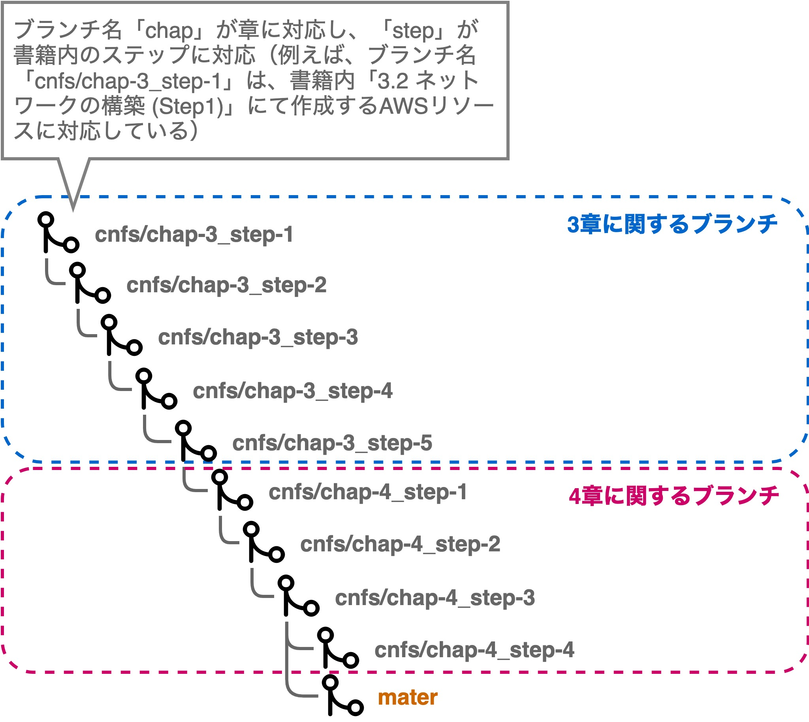

# Terraformを利用した書籍「xxx」のハンズオン実施

- TODO: 書籍名が決まったらタイトル修正

本リポジトリのTerraformソースコードは書籍「xxxx」の内容と連動してAWSリソースを作成することができます。
具体的には、書籍内3章で作成するVPCやサブネットといったネットワークの設定、ECSなどのコンテナ定義といったリソースや4章で作成するCodeCommitやCodePipelineなどのリソースについて、各章内のStepと併せて作成することができます。

普段AWSマネジメントコンソールからの作業ではなく、IaCなどTerraformを利用している方はこちらのソースコードを利用したハンズオンとしてご活用ください。

## 利用に関する前提事項

本手順はREDOME.mdに記載の内容を基に作成しています。
事前にREDOME.mdを参照いただき、必要な環境をセットアップした上で実施してください。

## 注意事項

### Terraform対象外のAWSリソース

現時点においてTerraformでは、すべてのAWSリソースを作成できるわけでなく、Featureとして対応中の対象も含まれています。
また、Cloud9のように、一部のリソースに関してはTerraform内に完結して関連するAWSリソースを組み合わせることが難しいケースもあります。

そのため、**書籍内で扱うすべてのAWSリソースを本ソースコードから作成できるわけではありません**。
このようなAWSリソースについては、各Stepのリソース作成手順内にて適宜補足していきます。

### 一部Terraformリソースの引数について

Amazon AuroraやAmazon Systems Managerパラメーターストアなどで扱う認証情報等においては、Terraformソースコード上はダミー値として定義し、Terraformでの差分検知対象外としています(一般的にクレデンシャルとして扱われる情報はソースコード等のフラットに扱われるファイルに記述すべきではない、という思想です)。

以上の理由により、**認証情報はAWSリソース作成後に手動で変更する方針**としています。
こちらについても、適宜各Stepのリソース作成手順内にて触れていきます。

### 書籍ハンズオン内容との差分について

本Terraformから作成されるALBとAuroraについて、利用後の削除作業簡単にするため**削除保護を無効化**しています。
一方、書籍ハンズオンの手順ではこれらの削除保護を有効化しています。**本番環境での運用を考えると削除保護は有効化が望ましい**設定となります。
あくまで、Terraformリソース作成後の削除しやすさを考慮した設定となっているためご留意ください。

## 事前の設定事項

### ソースコードの取得

REDOME.mdで作成したCloud9上で必要なブランチを取得します。

``` bash
$ mkdir terraform; ls -l; cd terraform

$ git clone https://github.com/iselegant/cntfdemo

$ cd cntfdemo

$ git branch
  cnfs/chap-3_step-1
  cnfs/chap-3_step-2
  cnfs/chap-3_step-3
  cnfs/chap-3_step-4
  cnfs/chap-3_step-5
  cnfs/chap-4_step-1
  cnfs/chap-4_step-2
  cnfs/chap-4_step-3
  cnfs/chap-4_step-4
* master

$ git pull --all
Already up-to-date.

$ git checkout cnfs/chap-3_step-1
Switched to branch 'cnfs/chap-3_step-1'
Your branch is up-to-date with 'origin/cnfs/chap-3_step-1'.
```

- TODO: git cloneの出力結果を記載する

### Terraform内一部変数も設定

ソースコードを取得後、事前にそれぞれのAWS環境に合わせたTerraform変数の設定が必要となります。
以下ファイルを修正し、変数の値を書き換えてください。

``` bash
# dependiencies.tfのdummyを利用するAWS環境のAWSアカウントIDに書き換える
# 例) "dummy" -> "0123456789012"
$ cat main/dependencies.tfvars
aws_account_id = "dummy"
```

## 3章に関する手順

以下のように各章の各Stepと本リポジトリのブランチについて、1対1で紐付いています。



そのため、各Step毎にブランチ切り替えながら`terragrunt apply`を実行していくのが基本的な流れです。
以下に各章各Step毎の手順を記載します。

### Step3-1の実行

``` bash
# 共通系AWSリソースの作成

# 対象ステップのブランチ切り替え
$ git checkout cnfs/chap-3_step-1

# Terraformの実行
$ cd ~/terraform/cntfdemo/main/base/
$ terragrunt apply
[terragrunt] [/home/ec2-user/terraform/cntfdemo/main/base] 2020/07/05 07:43:37 Running command: terraform --version
[terragrunt] 2020/07/05 07:43:37 Terraform version: 0.12.25
[terragrunt] 2020/07/05 07:43:37 Reading Terragrunt config file at /home/ec2-user/terraform/cntfdemo/main/base/terragrunt.hcl
[terragrunt] [/home/ec2-user/terraform/cntfdemo/main/base] 2020/07/05 07:43:38 Initializing remote state for the s3 backend
[terragrunt] [/home/ec2-user/terraform/cntfdemo/main/base] 2020/07/05 07:43:38 Running command: terraform init -backend-config=bucket=cnapp-terraform-513132288478 -backend-config=dynamodb_table=cnapp-terraform-state-lock -backend-config=encrypt=true -backend-config=key=base/terraform.tfstate -backend-config=region=ap-northeast-1
Initializing modules...
- appbase in ../../modules/appbase
- base in ../../modules/combase

:

Plan: 15 to add, 0 to change, 0 to destroy.

Do you want to perform these actions?
  Terraform will perform the actions described above.
  Only 'yes' will be accepted to approve.

  Enter a value:   # [yes]と入力する

:

module.base.aws_vpc.main: Creating...
module.base.aws_vpc.main: Creation complete after 2s [id=vpc-059425c3f640195ca]
module.base.aws_subnet.db["c"]: Creating...
:
module.base.aws_route_table_association.management_internet["c"]: Creation complete after 0s [id=rtbassoc-0ad2c008fe8d0632a]
module.base.aws_route_table_association.ingress_internet["c"]: Creation complete after 0s [id=rtbassoc-0e38fa3c877710d92]

Apply complete! Resources: 15 added, 0 changed, 0 destroyed.

# 上記のように「Apply complete!」と表示されていれば成功
```

### Step3-2の実行

``` bash
# 共通系AWSリソースの作成

# 対象ステップのブランチ切り替え
$ git checkout cnfs/chap-3_step-2

# Terraformの実行
$ cd ~/terraform/cntfdemo/main/base/
$ terragrunt apply

# Step3-1同様に、「yes」と入力し、「Apply complete!」の表示を確認
# ALBの作成には2-3分ほど時間を要するはず(作者実績の場合、2分42秒要した)
```

``` bash
# アプリケーション系AWSリソースの作成

# Terraformの実行
$ cd ~/terraform/cntfdemo/main/app/
$ terragrunt apply
```

### Step3-3の実行

Step3-3ではCloud9の作成が必要ですが、Terraformでの作成は行いません。
なぜかというと、Cloud9のIDEを開くことができるのはCloud9を作成したIAMユーザのみとなります。
そのため、後続でCloud9を開くためにIAMユーザーのAWSアクセスキーを払い出して環境変数としてセットし、その情報を基にTerraformを実行するという流れが少々複雑となるからです。

また、TerraformにてCloud9リソース自体を作成することは可能ですが、Cloud9から間接的に作成されるEC2のインスタンス情報について、Terraformリソースをベースに参照することが出来ません。
そのため、ハンズオン内で行うEIPやインスタンスプロファイルの関連付けに対してどうしても手動フォローが必要となります。

ここでは構築をシンプルにするため、Cloud9及びこれに関連する紐付け作業においては手動で行います。

1. 共通系AWSリソースの作成

``` bash
# 対象ステップのブランチ切り替え
$ git checkout cnfs/chap-3_step-3

# Terraformの実行
$ cd ~/terraform/cntfdemo/main/base/
$ terragrunt apply

# Step3-1同様に、「yes」と入力し、「Apply complete!」の表示を確認
# VPCエンドポイントの作成には2分ほど時間を要する(筆者実績では1分43秒要した)
```

2. アプリケーション関連AWSリソースの作成

``` bash
# Terraformの実行
$ cd ~/terraform/cntfdemo/main/app/
$ terragrunt apply
```

3. 書籍内の「3.4.3 管理用インスタンスの作成 - IAMロールの作成と関連付け」を実施する。
ただし、IAMロール自体はTerraformにより作成されているため、EC2インスタンスへの関連付けのみを行う。
IAMロールの関連付け完了後、手順に従ってCloud9のAMTCを無効化する。

4. 書籍内の「3.4.6 コンテナイメージビルドとレジストリ登録」を実施する。

### Step3-4の実行

Step3-4ではほぼTerraformのみで必要なAWSリソースを作成することができます。
以下手順の通り、AWSリソース作成後に確認作業のみ手動で実施してください。

1. 共通系AWSリソースの作成

``` bash
# 対象ステップのブランチ切り替え
$ git checkout cnfs/chap-3_step-4

# Terraformの実行
$ cd ~/terraform/cntfdemo/main/base/
$ terragrunt apply

# Step3-1同様に、「yes」と入力し、「Apply complete!」の表示を確認
# VPCエンドポイントの作成には2分ほど時間を要する(筆者実績では1分43秒要した)
```

2. アプリケーション関連AWSリソースの作成

``` bash
# Terraformの実行
$ cd ~/terraform/cntfdemo/main/app/

# template providerのインストールが必要であるため、apply前にinitを実行する
$ terragrunt init
$ terragrunt apply
```

3. 書籍内の「3.5.7 コンテナデプロイ確認」を実施する。

### Step3-5の実行

### 4章に関する手順

### Step4-1の実行

### Step4-2の実行

### Step4-3の実行

### Step4-4の実行
