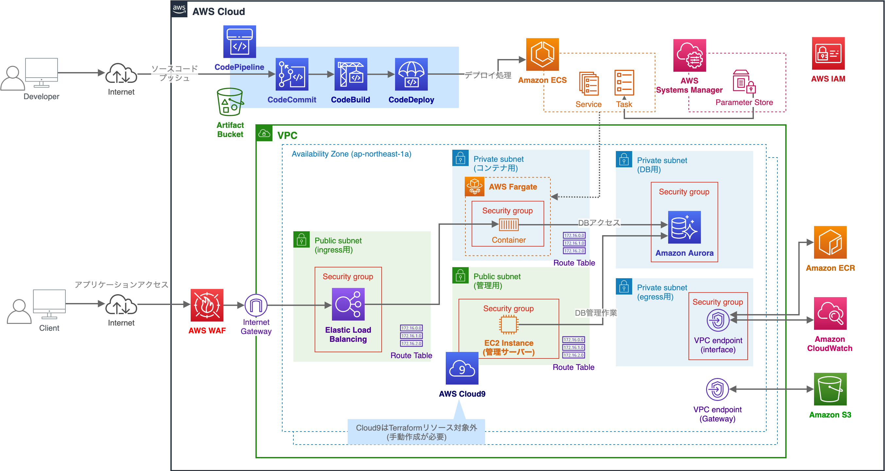
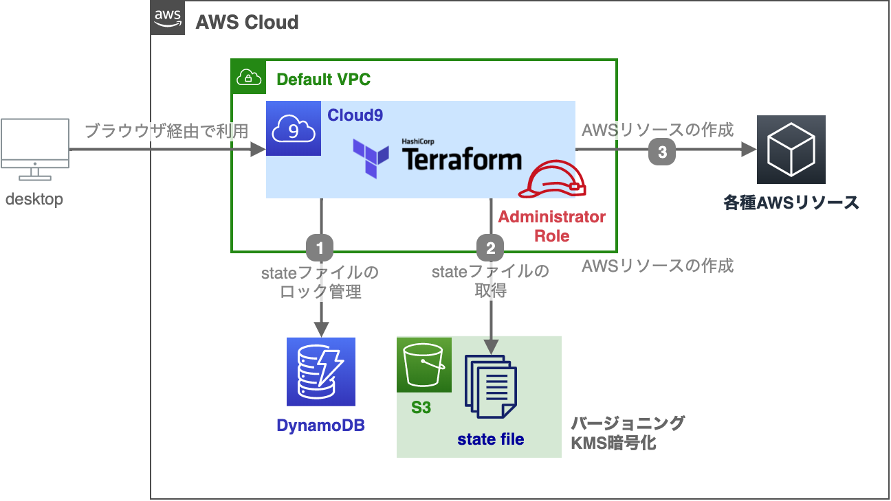

# cntfapp

## cntfappで実現できること

cntfappはクラウドネイティブなAWSサービス構成を構築できるTerraformソースコードです。
Amazon ECSやAWS Fargate、Amazon Codeシリーズを中心としたコンテナ・CI/CDの作成を行うことができます。
cntfappのTerraformを実行することで、以下のような環境を構築することが可能となっています。



cntfappではTerraformとTerragruntを利用していますが、これらのOSSの説明は割愛します。
内容を確認したい方は以下をご参照ください。

- [Terraform Website](https://www.terraform.io/)
- [Terraform - GitHub](https://github.com/hashicorp/terraform)
- [Terragrunt - Website](https://terragrunt.gruntwork.io/)
- [Terragrunt - GitHub](https://github.com/gruntwork-io/terragrunt) 

本ソースコードは筆者の書籍「**AWSで学ぶクラウドネイティブ実践入門**」内ハンズオンとして提供している環境構築に対応しています。本書と連動して作成を行う場合は、ソースコード内 BOOK.md を参照してください。

## OSS利用バージョン

TODO: バージョン記載

- Terraform:
- Terragrunt:

## 利用に際した前提事項

以下のようにcntfappは**AWS Cloud9上でのTerraform/Terragrunt実行**を前提に作成しています。



Terraformを利用した複数開発者によるAWSリソース競合や意図しないAWSリソース削除を回避できるように、ロックファイルをDynamoDB上で管理する構成としています。
また、AWSリソースの作成状態を管理するstateファイルをS3上に管理しています。
Terraformではこのstateファイルが非常に重要な位置づけとなっており、S3は暗号化及びバージョニングの設定を行っています。

環境構築に利用するCloud9では一時クレデンシャル(AMTC: AWS Managed Temporary Credentials)が利用できますが、この権限では今回のTerraformハンズオンで一部作成できないリソースが存在します。
そのため、明示的にAdministratorRoleをインスタンスプロファイルとしてCloud9用EC2インスタンスにアタッチする方針となっています。

次に示す手順を実施し、実行環境のセットアップから実施してください。

## 環境利用のためのセットアップ

### Terraform利用の準備

1. Amazon S3 Bucketの作成

まずはTerraformステートファイルを保持するためのS3バケットを作成します。


2. Amazon DynamoDBの作成

3. Amazon Cloud9の作成

4. IAMロールの作成

5. インスタンスプロファイルの付与

### tfenvのインストール

- TODO: tfenvバージョンの最新化

```bash
# インストール対象のディレクトリを作成
$ mkdir .tfenv

# Githubリポジトリからtfenvをダウンロードし、所定の場所にインストール
$ wget https://github.com/tfutils/tfenv/archive/v2.0.0.tar.gz
$ tar zxvf ../v2.0.0.tar.gz
$ mv tfenv-2.0.0/* .tfenv/

# tfenv実行に必要なパスを通す
$ echo 'export PATH="$HOME/.tfenv/bin:$PATH"' >> ~/.bash_profile
$ source ~/.bash_profile

# バージョンの確認 (下記出力内容は2020年7月5時点の内容)
$ tfenv
tfenv 2.0.0
Usage: tfenv <command> [<options>]

Commands:
   install       Install a specific version of Terraform
   use           Switch a version to use
   uninstall     Uninstall a specific version of Terraform
   list          List all installed versions
   list-remote   List all installable versions

# 不要なファイルを削除
$ rm -rf tfenv-2.0.0*
$ rm v2.0.0.tar.gz
```

### Terraformのインストール

- TODO: Terraformバージョンの最新化

```bash
# v0.12.25のインストール
$ tfenv install 0.12.25
Installing Terraform v0.12.25
Downloading release tarball from https://releases.hashicorp.com/terraform/0.12.25/terraform_0.12.25_linux_amd64.zip
######################################################################################################################################################################################################################################################### 100.0%
Downloading SHA hash file from https://releases.hashicorp.com/terraform/0.12.25/terraform_0.12.25_SHA256SUMS
No keybase install found, skipping OpenPGP signature verification
Archive:  tfenv_download.BGgMie/terraform_0.12.25_linux_amd64.zip
  inflating: /home/ec2-user/.tfenv/versions/0.12.25/terraform  
Installation of terraform v0.12.25 successful. To make this your default version, run 'tfenv use 0.12.25'

# インストールしたバージョンの有効化
$ tfenv use 0.12.25
Switching default version to v0.12.25
Switching completed
$ tfenv list
* 0.12.25 (set by /home/ec2-user/.tfenv/version)

# terraformコマンドの実行確認
$ terraform -v
Terraform v0.12.25

Your version of Terraform is out of date! The latest version
is 0.12.28. You can update by downloading from https://www.terraform.io/downloads.html
```

### Terragruntのインストール

```bash
# Terragruntのダウンロード
$ wget https://github.com/gruntwork-io/terragrunt/releases/download/v0.23.31/terragrunt_linux_amd64

# ダウンロードしたバイナリファイルの配置
$ mv terragrunt_linux_amd64 terragrunt
$ chmod 755 terragrunt
$ sudo mv terragrunt /usr/local/bin/

# terragruntコマンドの実行確認
$ terragrunt -v
terragrunt version v0.23.31
```

### 実行とAWSリソースの作成

## リソースの削除

- TODO: Terraformリソースと手動で作成したリソースで手順が異なる旨

### Terraformリソースの削除

- TODO: 一部削除保護の解除が必要な旨を追記

#### ALBの削除保護を解除

1. AWS マネジメントコンソール上部の [サービス] タブより [EC2] を選択します。
2. EC2 ダッシュボードの左側ナビゲーションメニューから [ロードバランサー] を選択し、作成済みのリソース [cnapp-alb-ingress] が選択されていることを確認します。
3. ダッシュボード下部の [説明] ペイン内の属性カテゴリにて、 [属性の編集] ボタンを押します。
4. 削除保護の [有効化] チェックを外し、 [保存] ボタンを押します。
5. 削除保護が [有効] から [無効] に変更されていることを確認してください。

#### Amazon Auroraの削除保護を解除

1. AWS マネジメントコンソール上部の [サービス] タブより [RDS] を選択します。
2. Amazon RDS ダッシュボードの左側ナビゲーションメニューから [データベース] を選択し、作成済みのリソース [cnapp-db] が選択されていることを確認します。
3. ダッシュボード上部の [変更] ボタンを押します。
4. [削除保護の有効化] チェックを外し、 [次へ] ボタンを押します。
5. 削除保護の新しい値が [無効] になっていることを確認してください。変更のスケジュールとして [すぐに適用] を選択し、[クラスターの変更] ボタンを押します。
6. ダッシュボード内 [設定] タブを選択し、削除保護が [無効] に設定されていることを確認してください。

#### destroyによるTerraform作成リソースを削除

### 手動で作成したAWSリソースの削除

- TODO: 手動で作成したAWSリソースの削除手順

## 料金に関する補足

- TODO: 1枚もので料金がわかる図を作成

## 免責事項

- cntfappは利用者ご自身の判断と責任において行われるものとします。

- 筆者が作成した文書・画像・ソフトウェア・リンクその他各種情報等については、慎重に作成、管理し、正確性を保つようには努めていますが、万一記載情報が事実と異なる場合は、Issueを作成していただけると幸いです。

- cntfappの内容の全部または一部を事前の告知なしに変更する場合があります。

- cntfapp上から入手された情報により発生したあらゆる損害に関して一切の責任を負いません。
ここに掲載する情報およびリンクが設定されている他のサイトから取得された各種情報の利用によって生じたあらゆる損害に関しても一切の責任を負いません。
