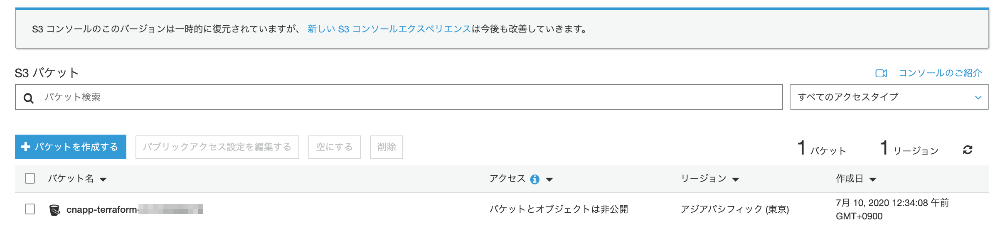
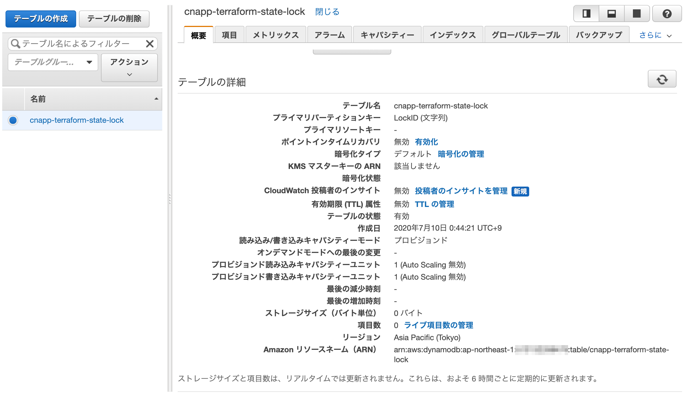
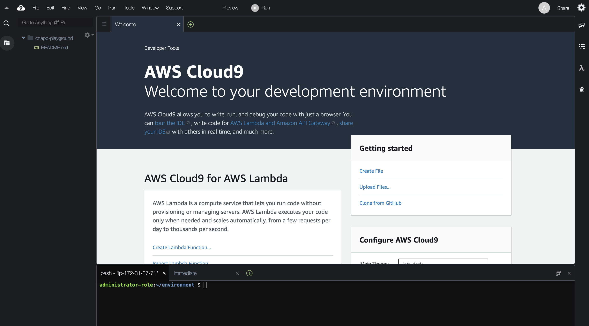
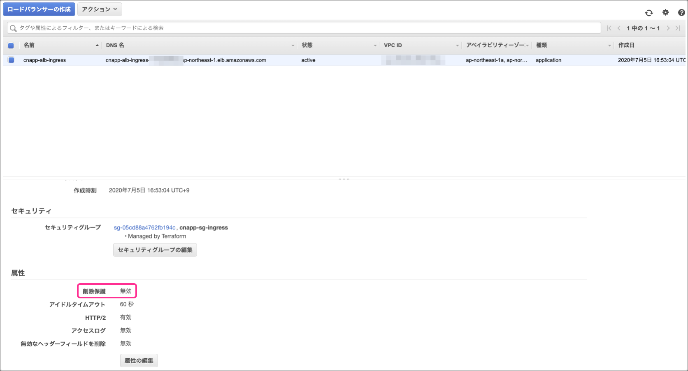
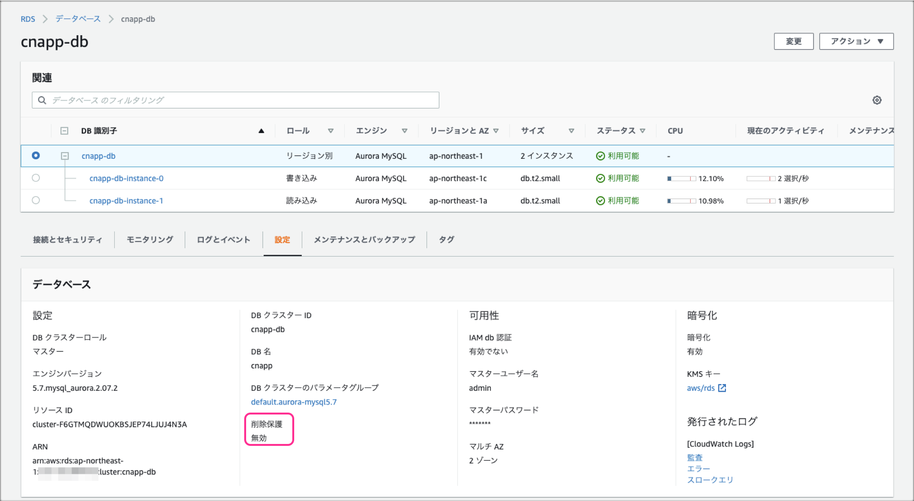

# cntfdemo

## cntfdemoで実現できること

cntfdemoはクラウドネイティブなAWSサービス構成を構築できるTerraformソースコードです。
Amazon ECSやAWS Fargate、Amazon Codeシリーズを中心としたコンテナ・CI/CDの作成を行うことができます。
cntfdemoのTerraformを実行することで、以下のような環境を構築することが可能となっています。


cntfdemoではTerraformとTerragruntを利用していますが、これらのOSSの説明は割愛します。
内容を確認したい方は以下をご参照ください。

- [Terraform Website](https://www.terraform.io/)
- [Terraform - GitHub](https://github.com/hashicorp/terraform)
- [Terragrunt - Website](https://terragrunt.gruntwork.io/)
- [Terragrunt - GitHub](https://github.com/gruntwork-io/terragrunt) 

本ソースコードは筆者の書籍「**AWSで学ぶクラウドネイティブ実践入門**」内ハンズオンとして提供している環境構築に対応しています。本書と連動して作成を行う場合は、ソースコード内 BOOK.md を参照してください。

## OSS利用バージョン

- Terraform: v0.12.28
  - Terraform Provider AWS: 2.70.0
- Terragrunt: v0.23.31

## 利用に際した前提事項

以下のようにcntfdemoは**AWS Cloud9上でのTerraform/Terragrunt実行**を前提に作成しています。


Terraformを利用した複数開発者によるAWSリソース競合や意図しないAWSリソース削除を回避できるように、ロックファイルをDynamoDB上で管理する構成としています。
また、AWSリソースの作成状態を管理するstateファイルをS3上に管理しています。
Terraformではこのstateファイルが非常に重要な位置づけとなっており、S3は暗号化及びバージョニングの設定を行っています。

環境構築に利用するCloud9では一時クレデンシャル(AMTC: AWS Managed Temporary Credentials)が利用できますが、この権限では今回のTerraformハンズオンで一部作成できないリソースが存在します。
そのため、明示的にAdministratorRoleをインスタンスプロファイルとしてCloud9用EC2インスタンスにアタッチする方針となっています。

次に示す手順を実施し、実行環境のセットアップから実施してください。

## 環境利用のためのセットアップ

### Terraform利用の準備

#### Amazon S3 Bucketの作成

まずはTerraformステートファイルを保持するためのS3バケットを作成します。

1. AWSマネジメントコンソール上部の [サービス] タブより [ECS] を選択します。
2. S3ダッシュボードの左側ナビゲーションメニューから [バケット] を選択し、[+バケットを作成する] ボタンを押します。
3. [名前とリージョン] では、次のように各項目を入力後、 [次へ] ボタンを押します。

|項目名|値|
|-|-|
|バケット名|cnapp-terraform-[AWSアカウントID]|
|リージョン|アジアパフィフィック(東京)|
|既存のバケットから設定をコピー|(入力なし)|

4. [オプションの設定] では、次のように各項目を入力後、 [次へ] ボタンを押します。

|項目名|値|
|-|-|
|バージョニング|チェックする|
|サーバーアクセスのログ|チェックしない|
|Tags|(入力なし)|
|オブジェクトレベルのログ記録|チェックしない|
|デフォルト暗号化|チェックする(AES-256を選択)|
|オブジェクトのロック|チェックしない|
|CloudWatchリクエストメトリクス|チェックしない|

5. [アクセス許可の設定] では、次のように各項目を入力後、 [次へ] ボタンを押します。

|項目名|値|
|-|-|
|パブリックアクセスをすべてブロック|チェックする|
|システムのアクセス許可を管理|Amazon S3ログ配信グループにこのバケットへの書き込みアクセス権限は付与しない|

5. [確認] にて入力内容を確認し、 [バケットの作成] ボタンを押します。

6. S3ダッシュボード上にてS3バケットが作成できていることを確認してください。



#### Amazon DynamoDBの作成

次にTerraformロックファイル管理用のDynamoDBテーブルを作成します。

1. AWSマネジメントコンソール上部の [サービス] タブより [DynamoDB] を選択します。
2. DynamoDB ダッシュボードの左側ナビゲーションメニューから [テーブル] を選択し、[テーブルの作成] ボタンを押します。
3. [DynamoDBテーブルの作成] では、次のように各項目を入力後、 [作成] ボタンを押します。

|項目名|値|
|-|-|
|テーブル名|cnapp-terraform-state-lock|
|プライマリーキー|LockID(文字列)|
|ソートキーの追加|チェックしない|
|テーブル設定 - デフォルト設定の使用|チェックを外す|
|読み込み/書き込みキャパシティーモード|プロビジョンド|
|読み込みキャパシティー|チェックを外す|
|書き込みキャパシティー|チェックを外す|
|読み込みキャパシティーユニット|1|
|書き込みキャパシティーユニット|1|
|保管時の暗号化|デフォルト|

4. DynamoDBコンソール上にてテーブルが作成できていることを確認してください。



#### Amazon Cloud9の作成

Terraform実行環境であるCloud9を作成します。

1. AWSマネジメントコンソール上部の [サービス] タブより [Cloud9] を選択します。
2. Cloud9ダッシュボードの左側ナビゲーションメニューから [Account environments] を選択し、[Create environment] ボタンを押します。
3. [Step1 Name environment] では、次のように各項目を入力後、 [Next step] ボタンを押します。

|項目名|値|
|-|-|
|Name|cnapp-playground|
|Description|(入力なし)|
|ソートキーの追加|チェックしない|

4. [Step2 Configure settings] では、次のように各項目を入力・選択後、 [Next step] ボタンを押します。
ネットワークVPC及びサブネットはデフォルトのものを選択してください（デフォルトVPCが存在しない場合、インターネットに接続可能なVPCとサブネットを選択してください）。

|項目名|値|
|-|-|
|Environment type|Create a new EC2 instance for environment(direct access)|
|Instance type|t2.micro(1 GiB RAM + 1 vCPU)|
|Platform|Amazon Linux|
|Cost-saving setting|After 30 minutes(default)|
|Network(VPC)|vpc-xxxxxxx(default) ※インターネットに接続可能なVPC|
|Subnet|subnet-xxxxxxx | Default in ap-northeast-1a|

5. [Review] にて入力内容を確認し、 [Create environment] ボタンを押します。

6. 以下のようにCloud9コンソールが利用可能であることを確認してください。



#### インスタンスプロファイルのアタッチ

Cloud9ではマネジメントコンソールにログインしたIAMユーザーの権限で自動的に認証権限が設定される仕組みを持っています。これ は AWS Managed Temporary Credentials(以降「AMTC」と略します) と呼ばれています。

[AWS Managed Temporary Credentials](https://docs.aws.amazon.com/cloud9/latest/user-guide/auth-and-access-control.html#auth-and-access-control-temporary-managed-credentials)

IAMロール等の付与等も不要であるため便利なのですが、以下のような制約があります。

[Actions Supported by AWS Managed Temporary Credentials](https://docs.aws.amazon.com/ja_jp/cloud9/latest/user-guide/auth-and-access-control.html#auth-and-access-control-temporary-managed-credentials-supported)

今回は上記制約を回避するため、IAMロール作成し、インスタンスプロファイルとしてCloud9 EC2インスタンスにアタッチする方針とします。

ここではインスタンスにアタッチするためのIAMロールを作成します。

1. AWSマネジメントコンソールのトップ画面上部の [サービス] タブより [IAM] を 選択します。
2. IAMダッシュボードの左側ナビゲーションメニューから [ロール] を選択し、表示画面上部の [ロールの作成] ボタンを押します。
3. ロールの作成画面にて次表の項目を選択後、[次のステップ:アクセス権限] ボタンを 押します。

|項目名|値|
|-|-|
|信頼されたエンティティの種類を選択|AWSサービス|
|ユースケースの選択|EC2|

4. ロールの作成画面にて、[AdministratorAccess] にチェックを入れた後、[次ののステップ:タグ] ボタンを押します。
5. ここではタグの追加はスキップします。[次のステップ:確認] ボタンを押します。
6. 確認画面にて、次のように各項目を入力後、確認画面に表示された内容を確認し、[ロールの作成] ボタンを押します。

|項目名|値|
|-|-|
|ロール名|cnapp-cloud9-playground-role|
|ロールの説明|Allows EC2 instances to call AWS services on your behalf.|

7. IAMダッシュボードのロール一覧から [cnapp-cloud9-playground-role] が作成されていることを確認してください。

#### インスタンスプロファイルの付与

ここでは前手順で作成した cnapp-cloud90-playground-role をEC2インスタンスにアタッチしていきます。

1. AWSマネジメントコンソールのトップ画面上部の [サービス] タブより [EC2] を選択します。
2. EC2ダッシュボードの左側ナビゲーションメニューから [インスタンス] を選択 します。
インスタンス一覧画面から Name 列で [aws-cloud9-cnapp-playground-] のインスタンスを選択し、画面上部の [アクション] → [インスタンスの設定] → [IAMロールの割り当て/置換] を選択します。
3. IAMロールの割り当て/置換画面にて、IAMロールとして作成した [cnapp-cloud9-playground-role] を選択し、[適用] ボタンを押します。
4. IAM ロールオペレーションに成功した旨が表示されます。[閉じる] ボタンを押し、 EC2の設定内容を確認します。
5. 一覧の説明タブ内 [IAMロール] に [cnapp-cloud9-role] が表示されれば、関連付けが完了となります。

#### AMTCの無効化

EC2にアタッチしたIAMロールの適用を優先させるためにAMTCを無効化する必要があります。

1. AWS マネジメントコンソールのトップ 画面上部の [サービス] タブより [Cloud9] を選択します。
2. Cloud9 ダッシュボードの左側ナビゲーションメニューから [Your environments] を選択し、表示画面中央の cnapp-playground 内 [Open IDE] ボタンを押します。コンソールが表示されるまで待ちましょう。
3. 画面中央上部のタブの [+] ボタンを押し、[Open Preferences] を選択して新規タブを作成します。タブ画面内の左側ナビゲーションメニューから [AWS Settings] → [Credentials] を選択してください。
4. 表示される画面上の [AWS managed temporary credentials:] を OFFに設定してください。

以上により、Terraformを実行するためのCloud9環境が整いました。

### tfenvのインストール

tfenvはTerraformのバージョン管理や切り替えが簡単に行えるオープンソースです。
今回、Terraformのインストールはtfenvで実施することで容易にバージョン管理可能な構成方針とします。

```bash
# インストール対象のディレクトリを作成
$ cd ~/environment
$ mkdir .tfenv

# Githubリポジトリからtfenvをダウンロードし、所定の場所にインストール
$ wget https://github.com/tfutils/tfenv/archive/v2.0.0.tar.gz

$ tar zxvf ./v2.0.0.tar.gz
$ mv tfenv-2.0.0/* .tfenv/

# tfenv実行に必要なパスを通す
$ echo 'export PATH="$HOME/environment/.tfenv/bin:$PATH"' >> ~/.bash_profile
$ source ~/.bash_profile

# バージョンの確認 (下記出力内容は2020年7月5時点の内容)
$ tfenv
tfenv 2.0.0
Usage: tfenv <command> [<options>]

Commands:
   install       Install a specific version of Terraform
   use           Switch a version to use
   uninstall     Uninstall a specific version of Terraform
   list          List all installed versions
   list-remote   List all installable versions

# 不要なファイルを削除
$ rm -rf tfenv-2.0.0*
$ rm v2.0.0.tar.gz
```

### Terraformのインストール

次にtfenv経由でTerraformをインストールします。

```bash
$ tfenv install 0.12.28
Installing Terraform v0.12.28
Downloading release tarball from https://releases.hashicorp.com/terraform/0.12.28/terraform_0.12.28_linux_amd64.zip
####################################################################################################################################################### 100.0%
Downloading SHA hash file from https://releases.hashicorp.com/terraform/0.12.28/terraform_0.12.28_SHA256SUMS
No keybase install found, skipping OpenPGP signature verification
Archive:  tfenv_download.bfeXAO/terraform_0.12.28_linux_amd64.zip
  inflating: /home/ec2-user/environment/.tfenv/versions/0.12.28/terraform  
Installation of terraform v0.12.28 successful. To make this your default version, run 'tfenv use 0.12.28'

# インストールしたバージョンの有効化
$ tfenv use 0.12.28
Switching default version to v0.12.28
Switching completed
$ tfenv list
* 0.12.28 (set by /home/ec2-user/.tfenv/version)

# terraformコマンドの実行確認
$ terraform -v
Terraform v0.12.28
>>>>>>> cnfs/chap-3_step-4
```

### Terragruntのインストール

今回はTerraformのラッパーツールであるTerragruntを利用します。
Terragruntを利用することで、コードの重複を減らす(DRY; Don't Repeat Yourself)ことができ、コードの管理がよりシンプルになります。
ここでは、Terragruntのインストール手順を実施していきます。

```bash
# Terragruntのダウンロード
$ cd ~/environment
$ wget https://github.com/gruntwork-io/terragrunt/releases/download/v0.23.31/terragrunt_linux_amd64

# ダウンロードしたバイナリファイルの配置
$ mv terragrunt_linux_amd64 terragrunt
$ chmod 755 terragrunt
$ sudo mv terragrunt /usr/local/bin/

# terragruntコマンドの実行確認
$ terragrunt -v
terragrunt version v0.23.31
```

以上でTerraform実行に必要な準備がすべて整いました。

## Terraform実行とAWSリソースの作成

リソースの作成は共通系リソースとアプリケーション関連AWSリソースに分けて作成を行います。

### 共通系AWSリソースを作成

``` bash
# Terraformの実行
$ git checkout master
$ cd ~/environment/terraform/cntfdemo/main/base/
$ terragrunt apply
```

### アプリケーション系AWSリソース

``` bash
# Terraformの実行
$ cd ~/environment/terraform/cntfdemo/main/app/
$ terragrunt apply
```

これらコマンドにより、各AWSリソースが作成されますが、以下の点に関しては手動でフォローが必要です。
そのため、このままではアプリケーションの稼働やCI/CDの実行までは行うことができません。

- Dockerイメージの作成とECRへのプッシュ
- Aurora内のテーブル作成とサンプルデータ投入
- CI/CDに必要な設定ファイル(buildspec.yml, appspec.yamlなど)

アプリケーション稼働まで実施する場合は、「**AWSで学ぶクラウドネイティブ実践入門**」の内容とBOOK.mdの内容を参考に実施を進めてください。

## リソースの削除

今回作成したAWSリソースの削除手順を記載します。

### Terraformリソースの削除

作成された一部AWSリソースに関しては、削除保護が有効になっていますが、Terraformによる削除前にこれらリソースの削除保護を無効化しておく必要があります。

#### ALBの削除保護を解除

1. AWS マネジメントコンソール上部の [サービス] タブより [EC2] を選択します。
2. EC2 ダッシュボードの左側ナビゲーションメニューから [ロードバランサー] を選択し、作成済みのリソース [cnapp-alb-ingress] が選択されていることを確認します。
3. ダッシュボード下部の [説明] ペイン内の属性カテゴリにて、 [属性の編集] ボタンを押します。
4. 削除保護の [有効化] チェックを外し、 [保存] ボタンを押します。
5. 削除保護が [有効] から [無効] に変更されていることを確認してください。



#### Amazon Auroraの削除保護を解除

1. AWS マネジメントコンソール上部の [サービス] タブより [RDS] を選択します。
2. Amazon RDS ダッシュボードの左側ナビゲーションメニューから [データベース] を選択し、作成済みのリソース [cnapp-db] が選択されていることを確認します。
3. ダッシュボード上部の [変更] ボタンを押します。
4. [削除保護の有効化] チェックを外し、 [次へ] ボタンを押します。
5. 削除保護の新しい値が [無効] になっていることを確認してください。変更のスケジュールとして [すぐに適用] を選択し、[クラスターの変更] ボタンを押します。
6. ダッシュボード内 [設定] タブを選択し、削除保護が [無効] に設定されていることを確認してください。



#### S3バケット内ファイルの削除

バケット名 [cnapp-artifact-AWSアカウント名] について、以下手順を参考にファイルを空にしてください。

[S3 バケットを空にする方法](https://docs.aws.amazon.com/ja_jp/AmazonS3/latest/user-guide/empty-bucket.html)

#### Cloud9の削除

Cloud9環境 [cnapp-management-env] について、以下手順を参考に削除してください。

[Deleting an Environment in AWS Cloud9](https://docs.aws.amazon.com/ja_jp/cloud9/latest/user-guide/delete-environment.html)

※TerraformでCloud9環境が稼働するサブネットが削除される関係上、先に削除しておく必要があります。
また、Terraform操作を行っているCloud9 [cnapp-playground] を誤って消さないようにご注意ください。

#### destroyによるTerraform作成リソースを削除

以下を実施してください。

	``` bash
	$ cd ~/environment/terraform/cntfdemo/main/app/
	$ terragrunt destroy

	$ cd ~/environment/terraform/cntfdemo/main/base/
	$ terragrunt destroy
	# 全リソース削除には分弱ほど時間を要する(筆者実績では17分4秒要した)
	```

### 手動で作成したAWSリソースの削除

Terraform環境用に作成した以下リソースを削除してください。

- ステートファイル用S3バケット [cnapp-terraform-AWSアカウント名]
- ロック管理用DynamoDBテーブル [cnapp-terraform-state-lock]
- Terraform実行用Cloud9 [cnapp-playground]

## Fargate v1.4.0に関する補足事項

2020年7月17日時点において、ECSコンソールからFargate のプラットフォームバージョンとして1.4.0を指定したとしてもCodeDeployによるデプロイの場合、1.3.0でタスクが起動されてしまう事象を確認しています（AWSサポートからも同様の回答あり）。

appspec.yamlでPlatformVersionとして1.4.0を指定した後、CodeDeployコンソールから対象サービスに対してデプロイを実施することで回避可能との案内をいただいています。

- [Amazon ECS コンピューティングプラットフォームを選択します。 のデプロイの作成 (コンソール) - AWS CodeDeploy](https://docs.aws.amazon.com/ja_jp/codedeploy/latest/userguide/deployments-create-console-ecs.html)

- [AppSpec File 例 - AWS CodeDeploy](https://docs.aws.amazon.com/ja_jp/codedeploy/latest/userguide/reference-appspec-file-example.html#appspec-file-example-ecs)

いずれは解消されるか事象かと考えていますが、念の為ご留意ください。

## 料金に関する補足

- 準備中

## 免責事項

- cntfdemoは利用者ご自身の判断と責任において行われるものとします。

- 筆者が作成した文書・画像・ソフトウェア・リンクその他各種情報等については、慎重に作成、管理し、正確性を保つようには努めていますが、万一記載情報が事実と異なる場合は、Issueを作成していただけると幸いです。

- cntfdemoの内容の全部または一部を事前の告知なしに変更する場合があります。

- cntfdemo上から入手された情報により発生したあらゆる損害に関して一切の責任を負いません。
ここに掲載する情報およびリンクが設定されている他のサイトから取得された各種情報の利用によって生じたあらゆる損害に関しても一切の責任を負いません。
